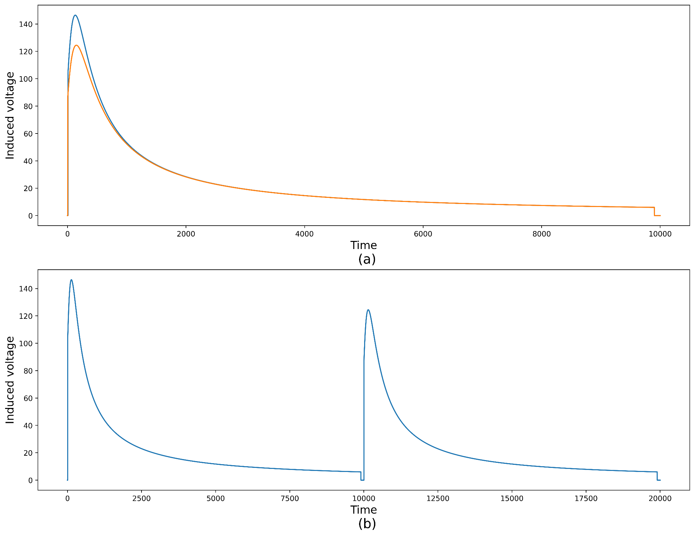
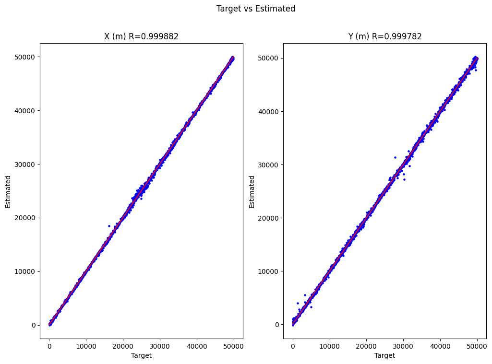
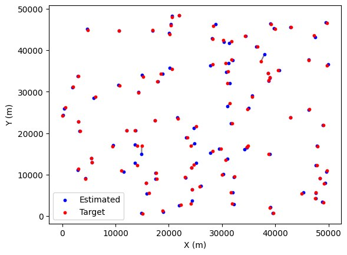

# Lightning Localization

Knowing the exact geolocation of a lightning strike is important in a wide range of research and application domains, including geophysical research, lightning warning, aviation/air traffic, weather services, insurance claims, power transmission and distribution, etc. 

## Data

For lightning localization in 2-D that utilizes data from the preinstalled voltage measurement systems on power transmission lines. The Fig 1 (a) signal of each sensor and (b) illustrates concatenate signals of sensors that is input of our model.

*Fig 1 sample of the induced voltages measured by the two sensors. signals (a) After the first preprocess (b) after the second
preprocess.*
## Model

An AE learns two functions: an encoding function that transforms the input data and a decoding function that recreates the input data from the encoded representation. AEs typically used for dimension reduction, but in this work used to expand the input data. After training AE, encoded data is used for input of the localization DNN model. As Fig 2 (a) shows the first part of AE is an encoder that includes three convolution layers. The first convolution layer has 4 filters and the kernel size is 4, the second layer has the same filter and the kernel size is 5 with 2 strides, and the last layer for the encoder has same the filter and kernel size as the second layer but with 1 stride. The decoder part includes three 1D transposed convolutions and the first layer of the decoder is the same as the last layer of the encoder and the second layer decoder has the same hyperparameter as the second encoder and so on. 

The second part of this model is localization DNN. Fig 2 (b) refers to this part that has an input layer with a size of 39972 that is encoded signal generated by AE and three hidden layers. The first hidden layer has 256 units with the ReLU activation function, and the last two hidden layers have 128 units with the ReLU activation function. 

*Fig 2 Architecture of AE + DNN model. (a) is AE architecture and (b) is DNN for localization.*
## Results
Fig. 3(a) and (b) are the scatter plots of the target versus output values where the blue dots correspond to the 10000 observations in the database. The best-fit lines are calculated using the least-squares regression method. The very high values of the coefficient of determination (R ) indicate that a high proportion of the variance in the data is explained by the fitting line. the root mean squared errors (RMSE) are 219.49 and 307.29 m for the x and y coordinates, respectively.

*Fig 3 Model evaluation results for (a) the x-coordinate and (b) the y-coordinate,*

*Fig 4 Scatter plot of the target (red dots) versus estimated (blue dots) 2-D geolocations for the
100 random sample of test dataset points using the AE + DNN model.*

